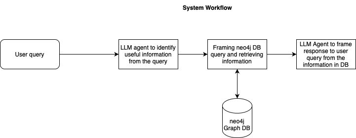
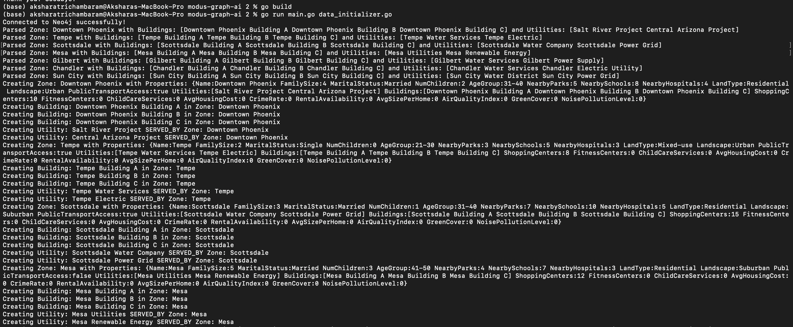
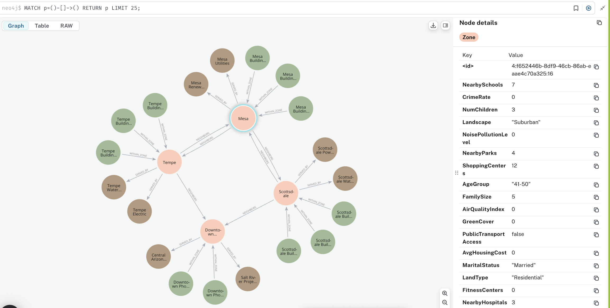
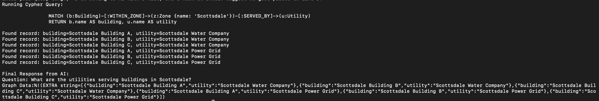

# Urban Planner & Relocation Assistant

This project was created during the Devpost Hackathon as a proof of concept for an **AI-driven Urban Planner and Relocation Assistant**. It utilizes **Go** for backend processing, integrates with **Neo4j** as a graph database, and plans to incorporate **LLM functionality** for enhanced user interactions.

## Project Overview

The Urban Planner & Relocation Assistant aims to help users make informed decisions about relocation by providing personalized recommendations based on various urban factors.

### Key Features:
1. **Data Preparation**:
   - Created sample datasets for **four zones** with diverse features like population density, transportation, amenities, and cost of living.
2. **Database Integration**:
   - Connected the backend to a **Neo4j graph database** for storing and retrieving data.
   - Designed queries to fetch user-specific insights and suggestions.
3. **User Interaction**:
   - Implemented a system to accept user queries and provide relevant results based on the graph database.

## Workflow

## How It Works
1. Input data about the user’s preferences and requirements.
2. Backend processes the query using Neo4j and retrieves relevant insights.
3. In future iterations, leverage LLMs to refine recommendations and handle complex queries.

### Graph Creation

### Graph Data Generation

### Graph Response Fetch

## Next Steps
- **LLM Integration**:
  - Enhance the system with **Large Language Model (LLM)** functionality to process natural language queries and generate detailed, personalized insights.
- **Feature Expansion**:
  - Add more granular data points, such as environmental factors, accessibility scores, and housing options.
- **Real-World Application**:
  - Build an intuitive user interface for seamless interaction.

## Tech Stack
- **Programming Language**: Go
- **Database**: Neo4j
- **Future Enhancements**: Integration with LLMs
